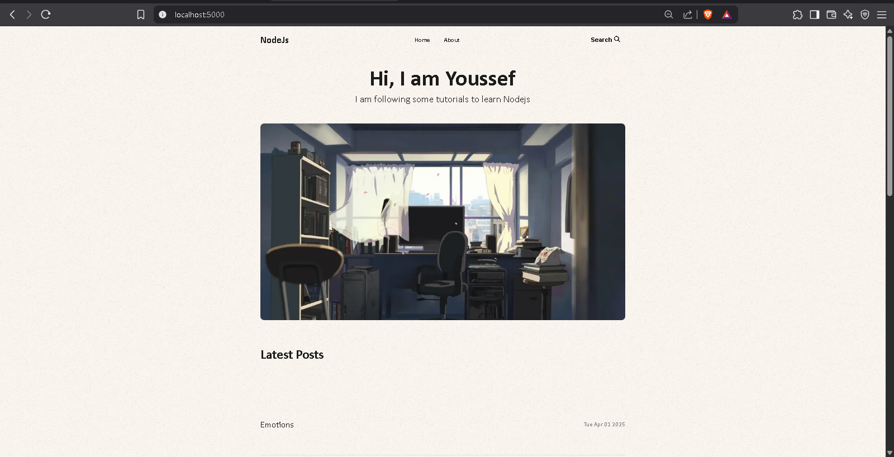

<b>What's needed:</b>
- Node.js
- MongoDB Free Cluster

<b>To run:</b>

First, ensure you have a MongoDB free database cluster: https://www.mongodb.com/

Second, create a .env file to store your credentials. Example below:
<pre>MONGODB_URI=mongodb+srv://<username>:<password>@clusterName.xxxxxxx.mongodb.net/blog
JWT_SECRET=MySecretBlog</pre>

Third, open your terminal and run:
<pre><bash>git clone https://github.com/usrmny/nodejs-blog.git</bash></pre>
Then move into the project directory: 
<pre><bash>cd nodejs-blog</bash></pre>

Fourth, make sure you have Node.js installed. Then to install the dependencies and start a server, run:
<pre><bash>npm install
npm run dev</bash></pre>

Finally, open `localhost:5000` in a brower to try it out.

